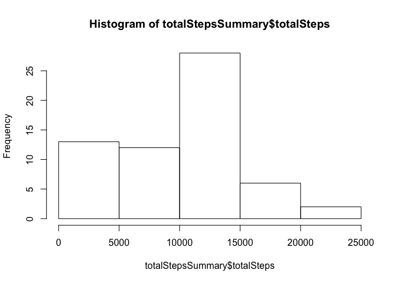
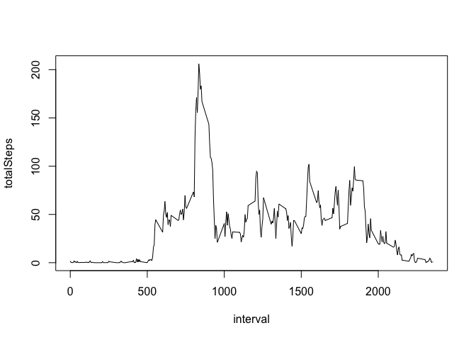
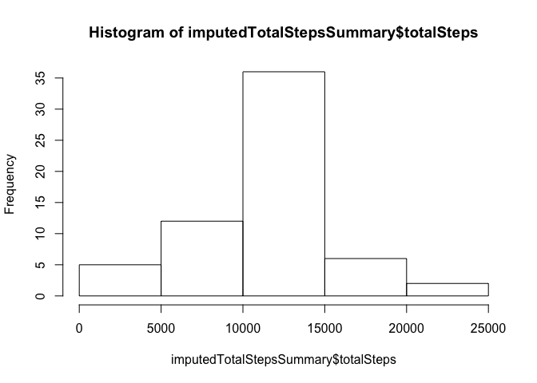
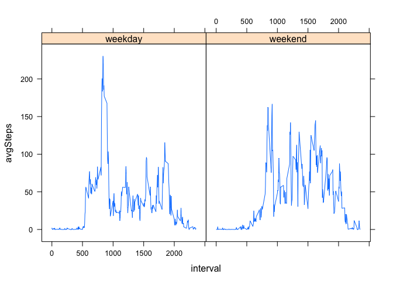

# Reproducible Research: Peer Assessment 1


## Loading and preprocessing the data

First, we'll load the data and transform date strings into an R-internal representation of dates.


```r
unzip('activity.zip')
theData <- read.csv('activity.csv')
theData$date <- as.Date(theData$date)
library(dplyr)
```

```
## 
## Attaching package: 'dplyr'
```

```
## The following objects are masked from 'package:stats':
## 
##     filter, lag
```

```
## The following objects are masked from 'package:base':
## 
##     intersect, setdiff, setequal, union
```

## What is mean total number of steps taken per day?

For this section, I am ignoring missing values (NA's) in the data set.  

I will make a histogram of the total number of steps taken each day. I then determine the mean and median number of steps taken each day.


```r
totalStepsSummary <- tbl_df(theData) %>% 
  group_by(date) %>%
  summarize(totalSteps = sum(steps, na.rm=TRUE))

hist(totalStepsSummary$totalSteps)
```

<!-- -->

```r
summary(totalStepsSummary$totalSteps)
```

```
##    Min. 1st Qu.  Median    Mean 3rd Qu.    Max. 
##       0    6778   10395    9354   12811   21194
```

## What is the average daily activity pattern?


Here, I make a time series plot of average steps taken per 5-minute interval.  I determine which 5-minute interval has, on average, the most steps taken per day.


```r
totalStepsSummary <- tbl_df(theData) %>% 
  group_by(interval) %>%
  summarize(totalSteps = mean(steps, na.rm=TRUE))

plot(totalStepsSummary, type='l')
```

<!-- -->

```r
cat(paste("Most steps are taken during interval", totalStepsSummary$interval[which.max(totalStepsSummary$totalSteps)]))
```

```
## Most steps are taken during interval 835
```

## Imputing missing values


Since there are many missing values in the data-set, it would be good to impute a value in those locations to attempt to correct for failed data collection.  This obviously introduces a potential for error, but evaluating the error is beyond the scope of this exercise.

In this section, I will:

1) Calculate the number of missing values in the dataset
1) Devise a strategy for imputing values in place of missing data
1) Create a dataset with imputed values following my strategy
1) Using the new dataset, create a histogram that shows the distribution of total number of steps taken per day.
1) Find the mean and median number of steps taken per day as per my new, imputed dataset.


```r
avgIntervalSteps <- tbl_df(theData) %>%
  group_by(interval) %>%
  summarize(avgSteps = mean(steps, na.rm=TRUE))

imputedData <- theData
for(i in 1:nrow(imputedData)) {
  if(is.na(imputedData$steps[i])) {
    imputedData$steps[i] <- avgIntervalSteps$avgSteps[avgIntervalSteps$interval == imputedData$interval[i]]
  }
}

imputedTotalStepsSummary <- imputedData %>%
  group_by(date) %>%
  summarize(totalSteps = sum(steps))
hist(imputedTotalStepsSummary$totalSteps)
```

<!-- -->

```r
summary(imputedTotalStepsSummary$totalSteps)
```

```
##    Min. 1st Qu.  Median    Mean 3rd Qu.    Max. 
##      41    9819   10766   10766   12811   21194
```

Yes, they differ.  Median rises by about 400 steps, mean by about 1,400.

The impact is that we are now assigning steps to days/intervals that previously were being treated as 0.  The imputed data either has the number of steps in each interval remain the same, or if the data is missing we give it the average value for that interval.  Since each interval's step count remains the same or increases, the total number of steps in the day remains the same or increases.

## Are there differences in activity patterns between weekdays and weekends?


To address this question, I will create a plot that shows the average steps per interval broken out into two panels, one for weekdays and one for weekends.


```r
imputedDataWithWeekends <- imputedData %>%
  mutate(dow = weekdays(date)) %>%
  mutate(dayType = factor(dow %in% c("Saturday", "Sunday"), 
                          labels=c("weekday", "weekend"))) %>%
  group_by(dayType, interval) %>%
  summarize(avgSteps = mean(steps))

library(lattice)
xyplot(avgSteps ~  interval| dayType, data = imputedDataWithWeekends, type = "l")
```

<!-- -->


